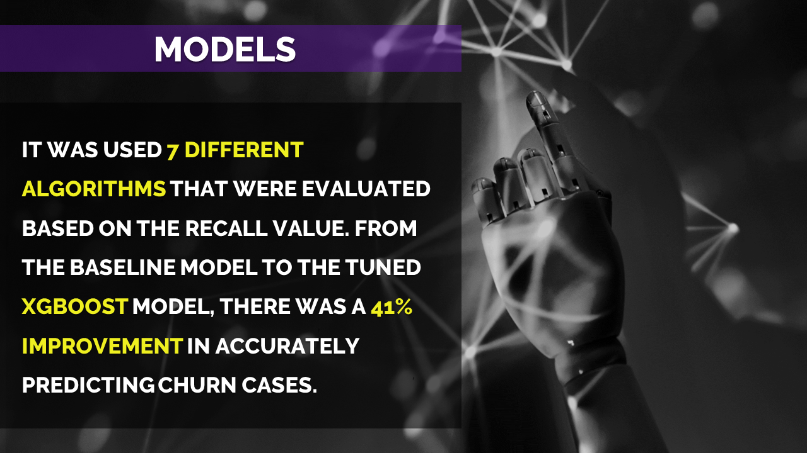

# Churn Prediction

 _Clique [aqui](https://github.com/raffaloffredo/churn_prediction_portuguese) para Português-BR_   
 

  

 

## About the project
The main goal of this study was to create a machine-learning model using the XGBoost algorithm to predict churn in a telecommunications company. To achieve this, exploratory data analysis was done to understand the dataset and to extract insights that could assist in the later stages of the project. Also, it was created 7 models using different algorithms and then evaluated by the Recall value. Finally, I optimized the XGBoost hyperparameters to obtain a better performance and conducted feature engineering to try to enhance even more the churn prediction.

* **[Code File](https://github.com/raffaloffredo/churn_prediction/blob/main/%5BLoffredoDS%5D_Predictive_Churn_Analysis_in_Telecommunications.ipynb)**
* **[Full Article](https://medium.com/@loffredo.ds/construction-of-predictive-churn-model-using-xgboost-899f206a52b8)**
* **[Summarized Article (Results)](https://www.linkedin.com/pulse/results-obtained-machine-learning-models-churn-raffaela-loffredo/)**
 

## Additional Material 
The results obtained with XGBoost algorithm model were condensed into images to generate a straightforward presentation of what the company could achieve with the use of this tool.

  

 

  

 

  

 

  

 

## Other Projects

* **[Credit card fraud detection](https://github.com/raffaloffredo/fraud_detection)**
* **[Airbnb New York](https://github.com/raffaloffredo/airbnb_new_york)**
* **[An updated study of COVID-19 in Brazil and the world](https://github.com/raffaloffredo/covid_2023)**
 

 ## Let's Connect

  
    
  
  
  

